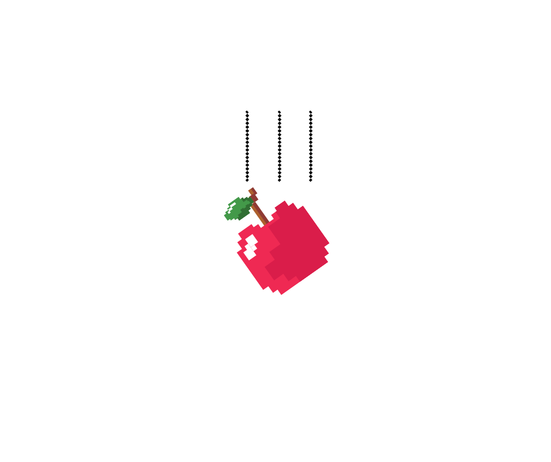
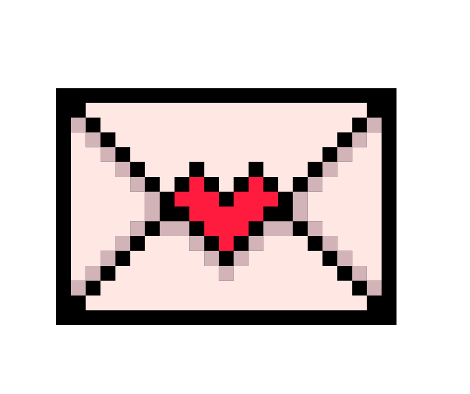
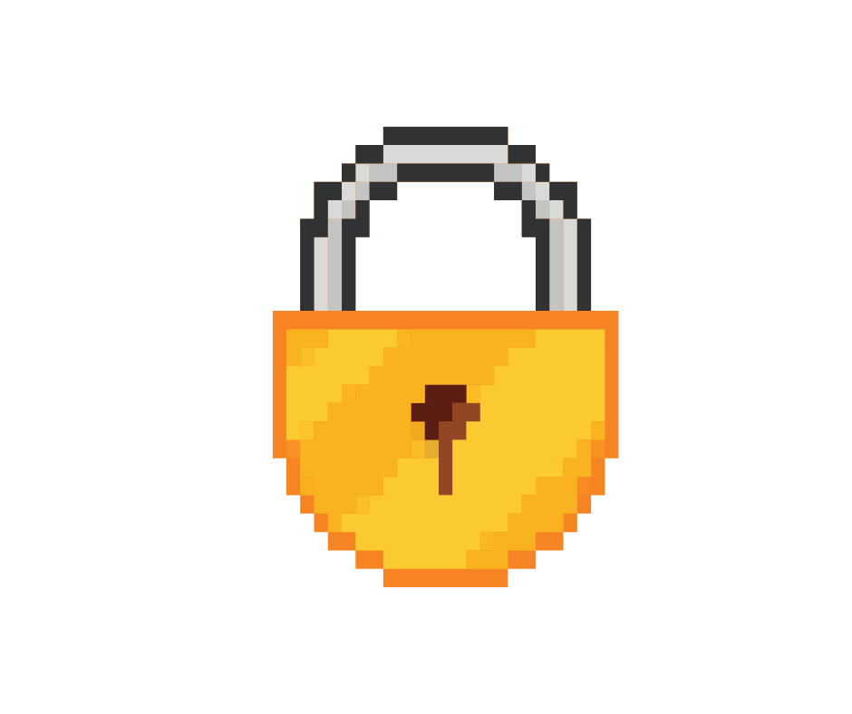

<body>

 
    <h1>Become a Cyber Wizard!</h1>
    <button onclick="goBack()" id="backBtn" class="backBtn">Back</button>
    

        
    

    

        
    

    

        
    

    

        
 test 

        <button id="closeModal"> Close </button>
    

</body>

