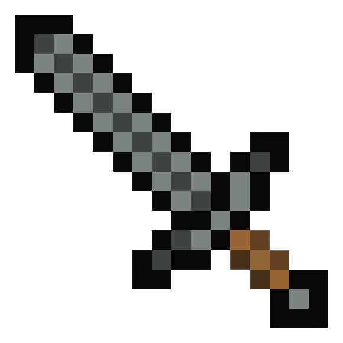

<link rel="stylesheet" href="https://fonts.googleapis.com/css2?family=Noto+Sans+Mono:wght@100..900&display=swap">

    <a href="multiplayer"><i class="bx bx-arrow-back" id="backIcon"></i></a>
    

        <h2>Available Lobbies</h2>
        

    

